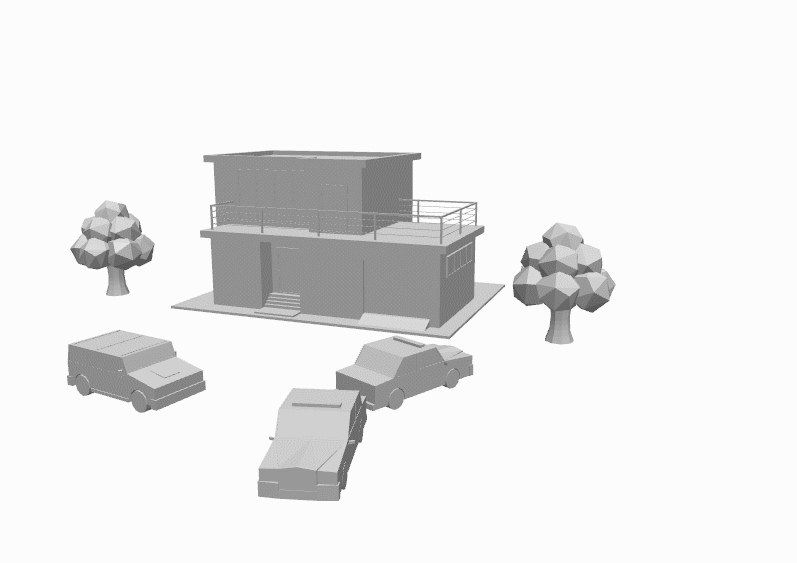

# OpenGL Practice
Учебный OpenGL С++ проект
***
### Реализовано ###
* Загрузка и использование шейдера, передача данных в шейдер
* Камера
* VAO, VBO
* Загрузка мешей из obj-файлов
* Освещение по методу Фонга

